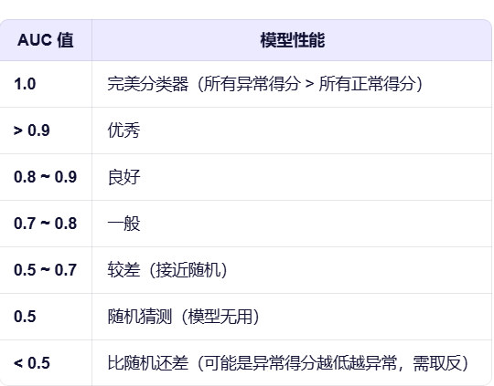
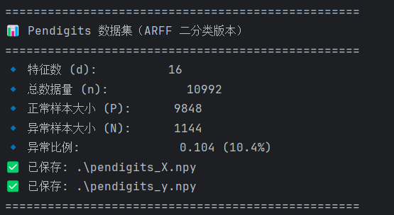
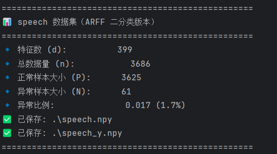
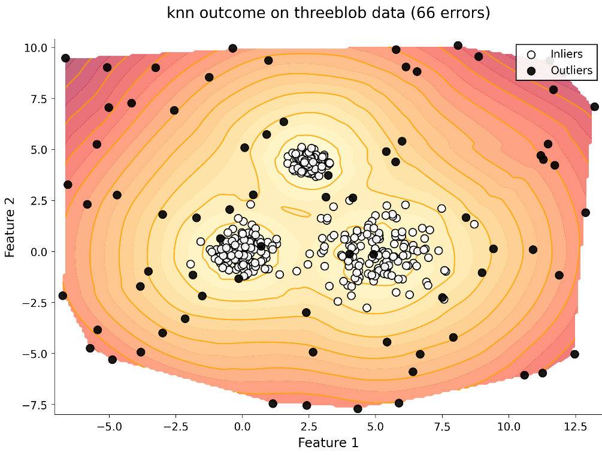

# 实验设计
## 实验背景
做异常值检测，数据有多个特征，执行完之后对每个数据基于密度计算一个score，然后对score进行排序，排序靠前的就认为是正常点，靠后的认为是异常点。
## 实验指标
指标主要是roc-auc和p@n。\
roc-auc取值0-1,判断的是不同的正常/异常阈值下的排序能力，即score对与正常和异常数据的区分程度。\

p@n的取值也是0-1,判断的是若取前N个为正常数据（N是实际的正常数据个数）的判断率，这个值越大说明结果判断的越正确
## 数据集
数据集分为生成数据集和真实数据集。\
生成数据集采用高斯分布在给定质点附近生成正常数据，再随机生成异常数据，来看不同算法的一个表现。gen_three_blob_data.py就是生成三个真实聚类的数据生成器，data里的threeblob_X.npy和threeblob_label.npy就是生成的500个数据。\
真实数据集：采用真实数据经过去除缺失值和特征标准化处理\
手写数据：[pendigits](https://www.openml.org/search?type=data&status=active&id=1019)\
\
演讲数据：[speech](https://www.openml.org/search?type=data&status=active&id=40910)\

## 模型
已实现baseline knn，还需要实现论文中的模型
## 输出
对于二维的生成数据，采用对score画热力图的方式展示结果。\
\
对于所有数据，生成roc和p@n指标的表格\
